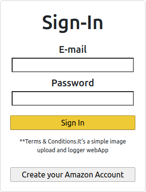
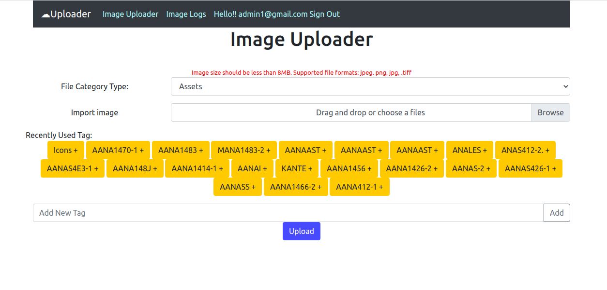
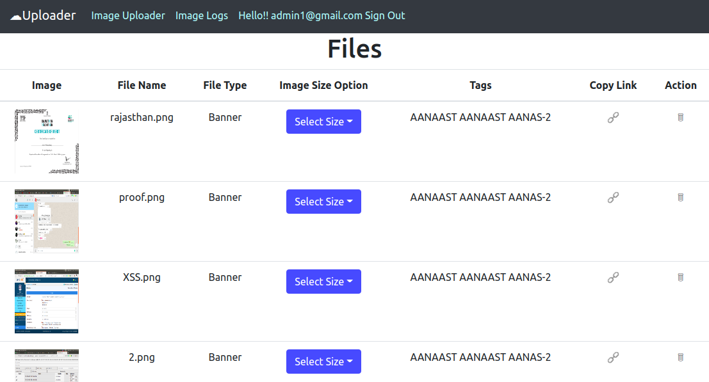

# IMAGE UPLOAD LOG

## Profiles

- Admin - With view, upload and delete images with add tags
- User - Images logs seen in different formats

## Checkout Hosted WebApp here

[Click Here!](https://image-upload-and-log.web.app/)

## Routes

- /admin - An admin page with toggle button for small screen and medium size
- /imageuploader - For uploading image and metadeta to the firebase
- /display - Dispay a table of images along with metadata and deleting opitions

## Project Archietecture

```tree
.
├── build
├── firebase.json
├── node_modules
├── package.json
├── package-lock.json
├── public---------------------> For Home page and rendering point of the project
├── README.md
└── src -----------------------> Source Folder Containing all the JS and ReactJS Code
    ├── App.css
    ├── App.js
    ├── App.test.js
    ├── Archives -----------------> Components used to build Image Uploader and Image Logger
    ├── Components----------------> Contains all the components of the project
    ├── firebase.js --------------> Firebase Credential File
    ├── index.css
    ├── index.js
    ├── logo.svg
    ├── reportWebVitals.js
    └── setupTests.js

```

### LOGIN/REGISTER using email address and password



### Image Uploader-(ADMIN) page for updating images and metadata



### Image Logger-(User/Admin) can access this page with different authorization aspects



# ADMIN PROFILE CREDENTIALS

- Email-
  -- ADMIN- admin1@gmail.com and admin2@gmail.com
  -- USERS- user1@gmail.com, user2@gmail.com, user3@gmail.com and user4@gmail.com
- Password(Same for all the profile candidates)
  Asdf@123
  
  ---------------------------------------------------------------------------------
Yet To Add
- Most recent post ascending order
- Delete Reference from Firestore and Storage
- Customize Tags with top recent 25
- Real time upload progress bar and Notification
